# [📈 Live Status](https://status.setditjen-djpb.net): <!--live status--> **🟧 Partial outage**

This repository contains the open-source uptime monitor and status page for [FrideyAlpha](https://status.setditjen-djpb.net), powered by [Upptime](https://github.com/upptime/upptime).

With [Upptime](https://upptime.js.org), you can get your own unlimited and free uptime monitor and status page, powered entirely by a GitHub repository. We use [Issues](https://github.com/FrideyAlpha/uptime-setditjen/issues) as incident reports, [Actions](https://github.com/FrideyAlpha/uptime-setditjen/actions) as uptime monitors, and [Pages](https://status.setditjen-djpb.net) for the status page.

<!--start: status pages-->
<!-- This summary is generated by Upptime (https://github.com/upptime/upptime) -->
<!-- Do not edit this manually, your changes will be overwritten -->
<!-- prettier-ignore -->
| URL | Status | History | Response Time | Uptime |
| --- | ------ | ------- | ------------- | ------ |
|  [Network](https://mycloud-jkt.zettagrid.id/tenant/Org_cloud60988) | 🟩 Up | [network.yml](https://github.com/FrideyAlpha/uptime-setditjen/commits/HEAD/history/network.yml) | 

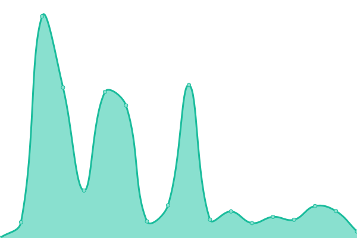 2535ms
     
 | 

<a href="https://status.setditjen-djpb.net/history/network">16.42%</a>
    

|  [Drive Sekretariat-DJPb](https://drive.setditjen-djpb.net) | 🟩 Up | [drive-sekretariat-dj-pb.yml](https://github.com/FrideyAlpha/uptime-setditjen/commits/HEAD/history/drive-sekretariat-dj-pb.yml) | 

 203ms
     
 | 

<a href="https://status.setditjen-djpb.net/history/drive-sekretariat-dj-pb">100.00%</a>
    

|  [Git Sekretariat-DJPb](https://git.setditjen-djpb.net) | 🟩 Up | [git-sekretariat-dj-pb.yml](https://github.com/FrideyAlpha/uptime-setditjen/commits/HEAD/history/git-sekretariat-dj-pb.yml) | 

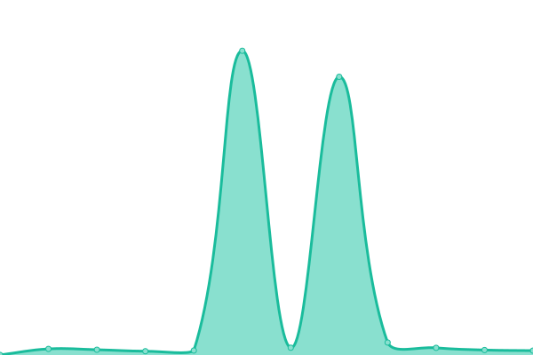 1974ms
     
 | 

<a href="https://status.setditjen-djpb.net/history/git-sekretariat-dj-pb">100.00%</a>
    

|  [Drone Sekretariat-DJPb](https://drone.setditjen-djpb.net) | 🟩 Up | [drone-sekretariat-dj-pb.yml](https://github.com/FrideyAlpha/uptime-setditjen/commits/HEAD/history/drone-sekretariat-dj-pb.yml) | 

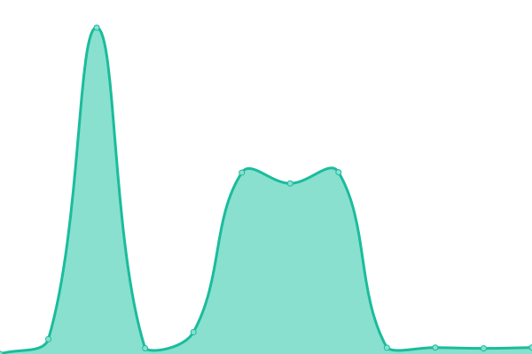 430ms
     
 | 

<a href="https://status.setditjen-djpb.net/history/drone-sekretariat-dj-pb">100.00%</a>
    

|  [API (DF) Sekretariat-DJPb](https://df1.setditjen-djpb.net) | 🟩 Up | [api-df-sekretariat-dj-pb.yml](https://github.com/FrideyAlpha/uptime-setditjen/commits/HEAD/history/api-df-sekretariat-dj-pb.yml) | 

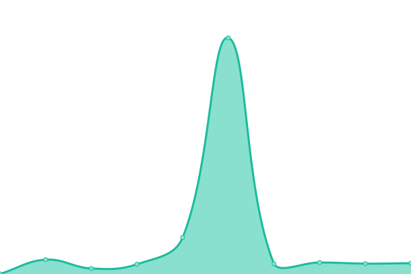 1267ms
     
 | 

<a href="https://status.setditjen-djpb.net/history/api-df-sekretariat-dj-pb">100.00%</a>
    

|  [API (AppWrite) Sekretariat-DJPb](https://appwrite.setditjen-djpb.net) | 🟥 Down | [api-app-write-sekretariat-dj-pb.yml](https://github.com/FrideyAlpha/uptime-setditjen/commits/HEAD/history/api-app-write-sekretariat-dj-pb.yml) | 

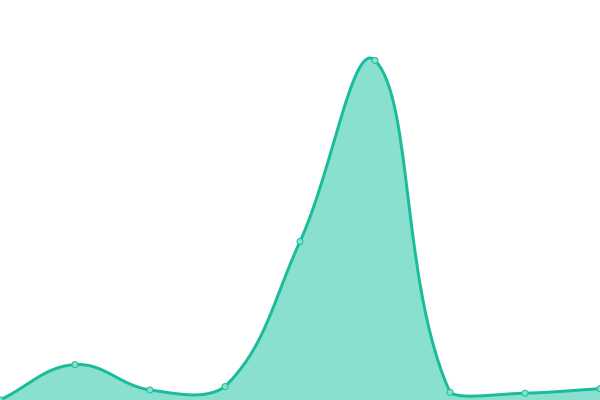 0ms
     
 | 

<a href="https://status.setditjen-djpb.net/history/api-app-write-sekretariat-dj-pb">0.00%</a>
    

|  [Minio Console Sekretariat-DJPb](https://minio-console.setditjen-djpb.net) | 🟩 Up | [minio-console-sekretariat-dj-pb.yml](https://github.com/FrideyAlpha/uptime-setditjen/commits/HEAD/history/minio-console-sekretariat-dj-pb.yml) | 

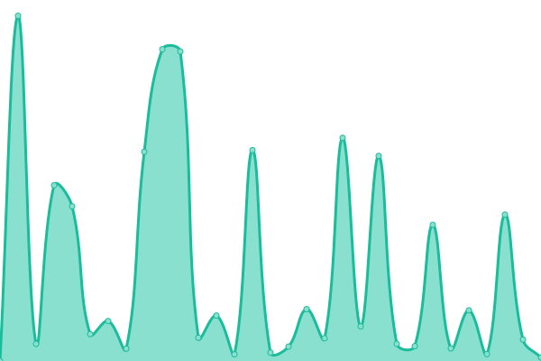 1552ms
     
 | 

<a href="https://status.setditjen-djpb.net/history/minio-console-sekretariat-dj-pb">100.00%</a>
    

|  [Minio 151](172.16.2.151) | 🟩 Up | [minio-151.yml](https://github.com/FrideyAlpha/uptime-setditjen/commits/HEAD/history/minio-151.yml) | 

 1ms
     
 | 

<a href="https://status.setditjen-djpb.net/history/minio-151">100.00%</a>
    

|  [Minio 157](172.16.2.157) | 🟩 Up | [minio-157.yml](https://github.com/FrideyAlpha/uptime-setditjen/commits/HEAD/history/minio-157.yml) | 

 1ms
     
 | 

<a href="https://status.setditjen-djpb.net/history/minio-157">100.00%</a>
    

|  [Minio 158](172.16.2.158) | 🟩 Up | [minio-158.yml](https://github.com/FrideyAlpha/uptime-setditjen/commits/HEAD/history/minio-158.yml) | 

 1ms
     
 | 

<a href="https://status.setditjen-djpb.net/history/minio-158">0.00%</a>
    

|  [Minio 159](172.16.2.159) | 🟩 Up | [minio-159.yml](https://github.com/FrideyAlpha/uptime-setditjen/commits/HEAD/history/minio-159.yml) | 

 1ms
     
 | 

<a href="https://status.setditjen-djpb.net/history/minio-159">100.00%</a>
    

|  [Analytic Sekretariat-DJPb](https://umami.setditjen-djpb.net) | 🟩 Up | [analytic-sekretariat-dj-pb.yml](https://github.com/FrideyAlpha/uptime-setditjen/commits/HEAD/history/analytic-sekretariat-dj-pb.yml) | 

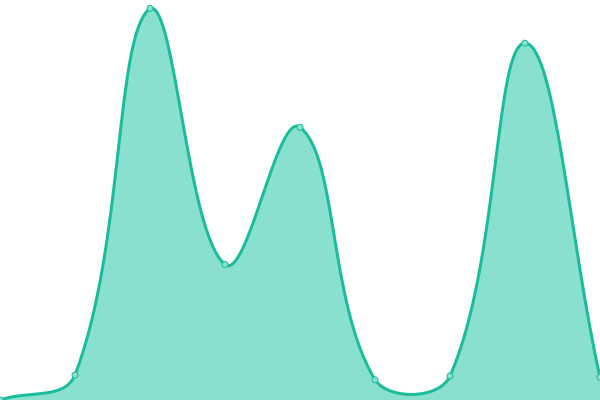 1180ms
     
 | 

<a href="https://status.setditjen-djpb.net/history/analytic-sekretariat-dj-pb">100.00%</a>
    

|  [SSO Sekretariat-DJPb](https://sso.setditjen-djpb.net) | 🟩 Up | [sso-sekretariat-dj-pb.yml](https://github.com/FrideyAlpha/uptime-setditjen/commits/HEAD/history/sso-sekretariat-dj-pb.yml) | 

 2504ms
     
 | 

<a href="https://status.setditjen-djpb.net/history/sso-sekretariat-dj-pb">0.00%</a>
    

|  [WDC Sekretariat-DJPb](https://wdc.setditjen-djpb.net) | 🟩 Up | [wdc-sekretariat-dj-pb.yml](https://github.com/FrideyAlpha/uptime-setditjen/commits/HEAD/history/wdc-sekretariat-dj-pb.yml) | 

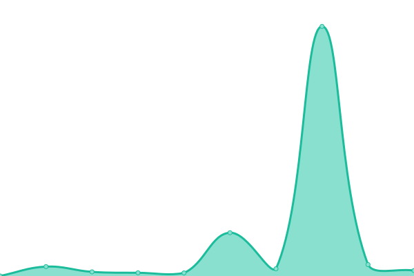 620ms
     
 | 

<a href="https://status.setditjen-djpb.net/history/wdc-sekretariat-dj-pb">0.00%</a>
    

|  [WDC Simulator Sekretariat-DJPb](https://wdcsimulator.setditjen-djpb.net) | 🟩 Up | [wdc-simulator-sekretariat-dj-pb.yml](https://github.com/FrideyAlpha/uptime-setditjen/commits/HEAD/history/wdc-simulator-sekretariat-dj-pb.yml) | 

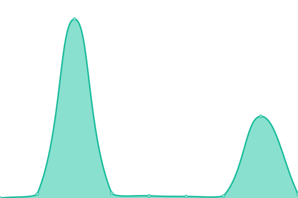 1035ms
     
 | 

<a href="https://status.setditjen-djpb.net/history/wdc-simulator-sekretariat-dj-pb">100.00%</a>
    

|  [Report 151 Sekretariat-DJPb](https://report151.setditjen-djpb.net) | 🟩 Up | [report-151-sekretariat-dj-pb.yml](https://github.com/FrideyAlpha/uptime-setditjen/commits/HEAD/history/report-151-sekretariat-dj-pb.yml) | 

 1136ms
     
 | 

<a href="https://status.setditjen-djpb.net/history/report-151-sekretariat-dj-pb">0.00%</a>
    

|  [Report 152 Sekretariat-DJPb](http://report152.setditjen-djpb.net) | 🟩 Up | [report-152-sekretariat-dj-pb.yml](https://github.com/FrideyAlpha/uptime-setditjen/commits/HEAD/history/report-152-sekretariat-dj-pb.yml) | 

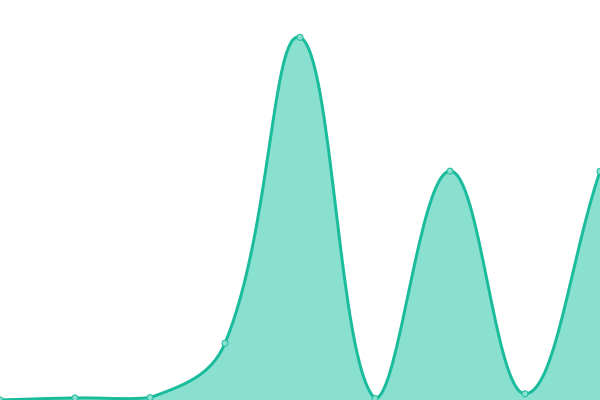 773ms
     
 | 

<a href="https://status.setditjen-djpb.net/history/report-152-sekretariat-dj-pb">100.00%</a>
    

|  [Report 153 Sekretariat-DJPb](https://report153.setditjen-djpb.net) | 🟩 Up | [report-153-sekretariat-dj-pb.yml](https://github.com/FrideyAlpha/uptime-setditjen/commits/HEAD/history/report-153-sekretariat-dj-pb.yml) | 

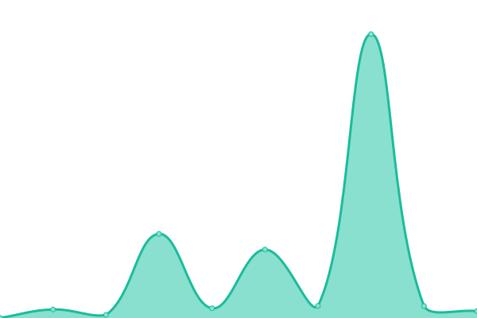 1627ms
     
 | 

<a href="https://status.setditjen-djpb.net/history/report-153-sekretariat-dj-pb">100.00%</a>
    

|  [Foto Services Sekretariat-DJPb](https://foto.setditjen-djpb.net) | 🟩 Up | [foto-services-sekretariat-dj-pb.yml](https://github.com/FrideyAlpha/uptime-setditjen/commits/HEAD/history/foto-services-sekretariat-dj-pb.yml) | 

 2125ms
     
 | 

<a href="https://status.setditjen-djpb.net/history/foto-services-sekretariat-dj-pb">0.00%</a>
    

|  [Tableau Sekretariat-DJPb](https://tableau.setditjen-djpb.net) | 🟩 Up | [tableau-sekretariat-dj-pb.yml](https://github.com/FrideyAlpha/uptime-setditjen/commits/HEAD/history/tableau-sekretariat-dj-pb.yml) | 

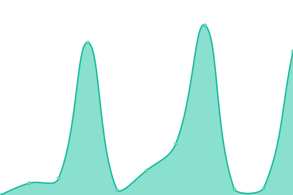 1148ms
     
 | 

<a href="https://status.setditjen-djpb.net/history/tableau-sekretariat-dj-pb">100.00%</a>
    

|  [Superset Sekretariat-DJPb](https://superset.setditjen-djpb.net) | 🟩 Up | [superset-sekretariat-dj-pb.yml](https://github.com/FrideyAlpha/uptime-setditjen/commits/HEAD/history/superset-sekretariat-dj-pb.yml) | 

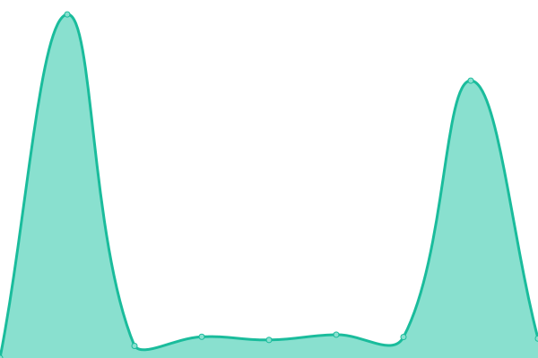 1117ms
     
 | 

<a href="https://status.setditjen-djpb.net/history/superset-sekretariat-dj-pb">100.00%</a>
    

|  [Redash Sekretariat-DJPb](https://redash.setditjen-djpb.net) | 🟩 Up | [redash-sekretariat-dj-pb.yml](https://github.com/FrideyAlpha/uptime-setditjen/commits/HEAD/history/redash-sekretariat-dj-pb.yml) | 

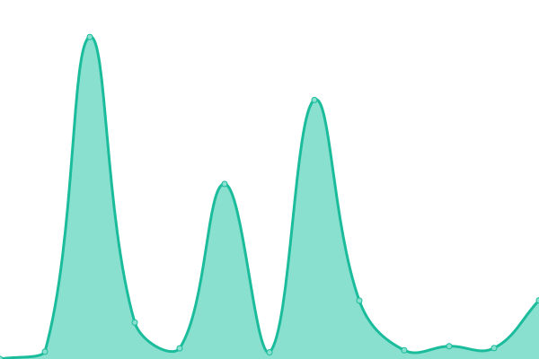 1221ms
     
 | 

<a href="https://status.setditjen-djpb.net/history/redash-sekretariat-dj-pb">100.00%</a>
    

|  [Chat Sekretariat-DJPb](https://chat.setditjen-djpb.net) | 🟩 Up | [chat-sekretariat-dj-pb.yml](https://github.com/FrideyAlpha/uptime-setditjen/commits/HEAD/history/chat-sekretariat-dj-pb.yml) | 

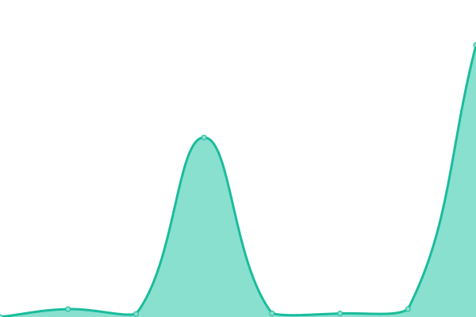 823ms
     
 | 

<a href="https://status.setditjen-djpb.net/history/chat-sekretariat-dj-pb">100.00%</a>
    

|  [Discourse Sekretariat-DJPb](https://discourse.setditjen-djpb.net) | 🟩 Up | [discourse-sekretariat-dj-pb.yml](https://github.com/FrideyAlpha/uptime-setditjen/commits/HEAD/history/discourse-sekretariat-dj-pb.yml) | 

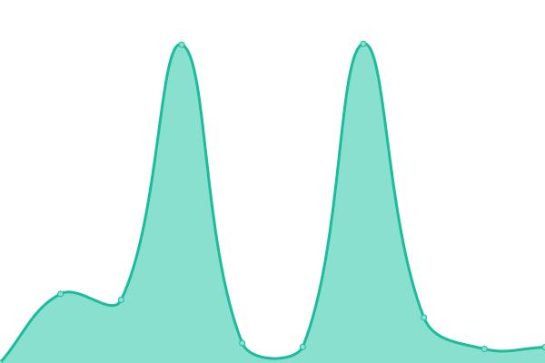 885ms
     
 | 

<a href="https://status.setditjen-djpb.net/history/discourse-sekretariat-dj-pb">100.00%</a>
    

|  [Simka Sekretariat-DJPb](https://simka.setditjen-djpb.net) | 🟩 Up | [simka-sekretariat-dj-pb.yml](https://github.com/FrideyAlpha/uptime-setditjen/commits/HEAD/history/simka-sekretariat-dj-pb.yml) | 

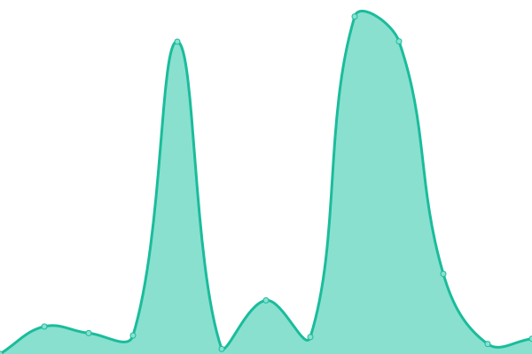 1583ms
     
 | 

<a href="https://status.setditjen-djpb.net/history/simka-sekretariat-dj-pb">0.00%</a>
    

|  [Simka (dev) Sekretariat-DJPb](https://simka-dev.setditjen-djpb.net) | 🟩 Up | [simka-dev-sekretariat-dj-pb.yml](https://github.com/FrideyAlpha/uptime-setditjen/commits/HEAD/history/simka-dev-sekretariat-dj-pb.yml) | 

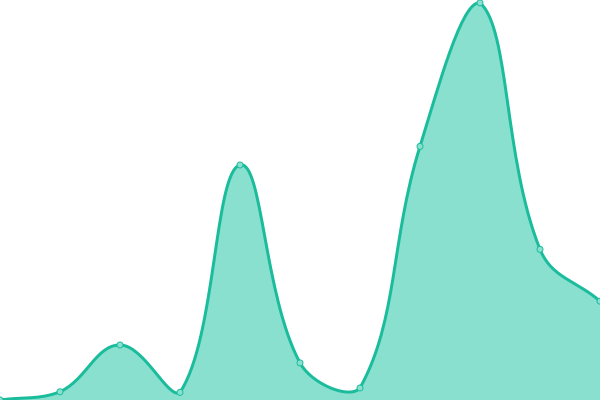 1189ms
     
 | 

<a href="https://status.setditjen-djpb.net/history/simka-dev-sekretariat-dj-pb">0.00%</a>
    

|  [Abid Sekretariat-DJPb](https://abid.setditjen-djpb.net) | 🟩 Up | [abid-sekretariat-dj-pb.yml](https://github.com/FrideyAlpha/uptime-setditjen/commits/HEAD/history/abid-sekretariat-dj-pb.yml) | 

 1104ms
     
 | 

<a href="https://status.setditjen-djpb.net/history/abid-sekretariat-dj-pb">80.21%</a>
    

|  [Abid (dev) Sekretariat-DJPb](https://abid-dev.setditjen-djpb.net) | 🟩 Up | [abid-dev-sekretariat-dj-pb.yml](https://github.com/FrideyAlpha/uptime-setditjen/commits/HEAD/history/abid-dev-sekretariat-dj-pb.yml) | 

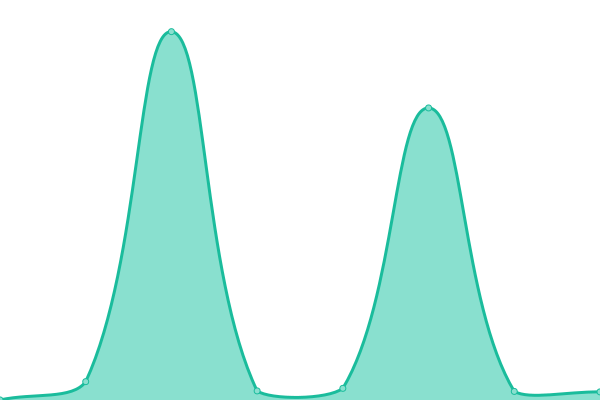 526ms
     
 | 

<a href="https://status.setditjen-djpb.net/history/abid-dev-sekretariat-dj-pb">0.00%</a>
    

|  [Simka (services) Sekretariat-DJPb](https://simka-services.setditjen-djpb.net) | 🟩 Up | [simka-services-sekretariat-dj-pb.yml](https://github.com/FrideyAlpha/uptime-setditjen/commits/HEAD/history/simka-services-sekretariat-dj-pb.yml) | 

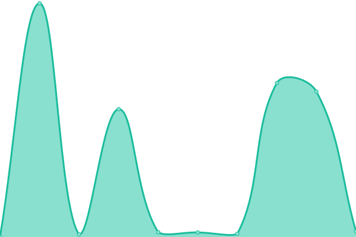 3102ms
     
 | 

<a href="https://status.setditjen-djpb.net/history/simka-services-sekretariat-dj-pb">100.00%</a>
    

|  [Simka (help) Sekretariat-DJPb](https://simka-help.setditjen-djpb.net) | 🟩 Up | [simka-help-sekretariat-dj-pb.yml](https://github.com/FrideyAlpha/uptime-setditjen/commits/HEAD/history/simka-help-sekretariat-dj-pb.yml) | 

 1207ms
     
 | 

<a href="https://status.setditjen-djpb.net/history/simka-help-sekretariat-dj-pb">0.00%</a>
    

|  [Silap (Kanpus) Sekretariat-DJPb](https://silap.setditjen-djpb.net) | 🟩 Up | [silap-kanpus-sekretariat-dj-pb.yml](https://github.com/FrideyAlpha/uptime-setditjen/commits/HEAD/history/silap-kanpus-sekretariat-dj-pb.yml) | 

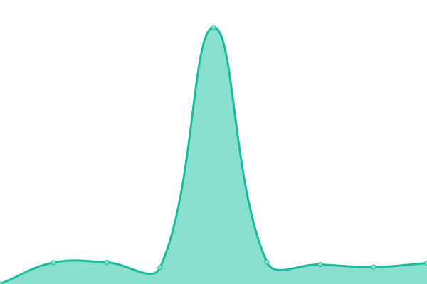 1651ms
     
 | 

<a href="https://status.setditjen-djpb.net/history/silap-kanpus-sekretariat-dj-pb">0.00%</a>
    

|  [Sipkk 2022 (Kanpus) Sekretariat-DJPb](https://sipkk2022.setditjen-djpb.net) | 🟥 Down | [sipkk-2022-kanpus-sekretariat-dj-pb.yml](https://github.com/FrideyAlpha/uptime-setditjen/commits/HEAD/history/sipkk-2022-kanpus-sekretariat-dj-pb.yml) | 

 0ms
     
 | 

<a href="https://status.setditjen-djpb.net/history/sipkk-2022-kanpus-sekretariat-dj-pb">0.00%</a>
    

|  [Sipkk 2021 (Kanpus) Sekretariat-DJPb](https://sipkk2021.setditjen-djpb.net) | 🟥 Down | [sipkk-2021-kanpus-sekretariat-dj-pb.yml](https://github.com/FrideyAlpha/uptime-setditjen/commits/HEAD/history/sipkk-2021-kanpus-sekretariat-dj-pb.yml) | 

 0ms
     
 | 

<a href="https://status.setditjen-djpb.net/history/sipkk-2021-kanpus-sekretariat-dj-pb">0.00%</a>
    

|  [Menawan Sekretariat-DJPb](https://menawan.setditjen-djpb.net) | 🟩 Up | [menawan-sekretariat-dj-pb.yml](https://github.com/FrideyAlpha/uptime-setditjen/commits/HEAD/history/menawan-sekretariat-dj-pb.yml) | 

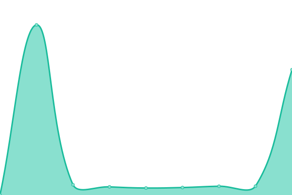 745ms
     
 | 

<a href="https://status.setditjen-djpb.net/history/menawan-sekretariat-dj-pb">100.00%</a>
    

|  [Trust (dev) Sekretariat-DJPb](https://trustdev.setditjen-djpb.net) | 🟩 Up | [trust-dev-sekretariat-dj-pb.yml](https://github.com/FrideyAlpha/uptime-setditjen/commits/HEAD/history/trust-dev-sekretariat-dj-pb.yml) | 

 645ms
     
 | 

<a href="https://status.setditjen-djpb.net/history/trust-dev-sekretariat-dj-pb">100.00%</a>
    

|  [Merapat Sekretariat-DJPb](https://merapat.setditjen-djpb.net) | 🟩 Up | [merapat-sekretariat-dj-pb.yml](https://github.com/FrideyAlpha/uptime-setditjen/commits/HEAD/history/merapat-sekretariat-dj-pb.yml) | 

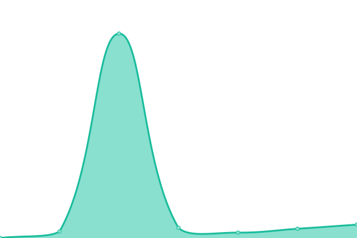 901ms
     
 | 

<a href="https://status.setditjen-djpb.net/history/merapat-sekretariat-dj-pb">83.54%</a>
    

|  [Sipat Sekretariat-DJPb](https://sipat.setditjen-djpb.net) | 🟥 Down | [sipat-sekretariat-dj-pb.yml](https://github.com/FrideyAlpha/uptime-setditjen/commits/HEAD/history/sipat-sekretariat-dj-pb.yml) | 

 1038ms
     
 | 

<a href="https://status.setditjen-djpb.net/history/sipat-sekretariat-dj-pb">0.00%</a>
    

|  [Sakura Sekretariat-DJPb](http://sakura.setditjen-djpb.net) | 🟩 Up | [sakura-sekretariat-dj-pb.yml](https://github.com/FrideyAlpha/uptime-setditjen/commits/HEAD/history/sakura-sekretariat-dj-pb.yml) | 

 2162ms
     
 | 

<a href="https://status.setditjen-djpb.net/history/sakura-sekretariat-dj-pb">0.00%</a>
    

|  [Info (Privacy Policy & Terms and Conditions) Sekretariat-DJPb](https://info.setditjen-djpb.net) | 🟩 Up | [info-privacy-policy-and-terms-and-conditions-sekretariat-dj-pb.yml](https://github.com/FrideyAlpha/uptime-setditjen/commits/HEAD/history/info-privacy-policy-and-terms-and-conditions-sekretariat-dj-pb.yml) | 

 802ms
     
 | 

<a href="https://status.setditjen-djpb.net/history/info-privacy-policy-and-terms-and-conditions-sekretariat-dj-pb">100.00%</a>
    

|  [Pivot (Abid) Sekretariat-DJPb](https://pivot.setditjen-djpb.net) | 🟥 Down | [pivot-abid-sekretariat-dj-pb.yml](https://github.com/FrideyAlpha/uptime-setditjen/commits/HEAD/history/pivot-abid-sekretariat-dj-pb.yml) | 

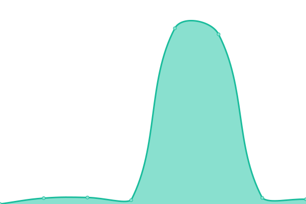 1289ms
     
 | 

<a href="https://status.setditjen-djpb.net/history/pivot-abid-sekretariat-dj-pb">2.07%</a>
    

|  [Tlearning Sekretariat-DJPb](https://tlearning.setditjen-djpb.net) | 🟩 Up | [tlearning-sekretariat-dj-pb.yml](https://github.com/FrideyAlpha/uptime-setditjen/commits/HEAD/history/tlearning-sekretariat-dj-pb.yml) | 

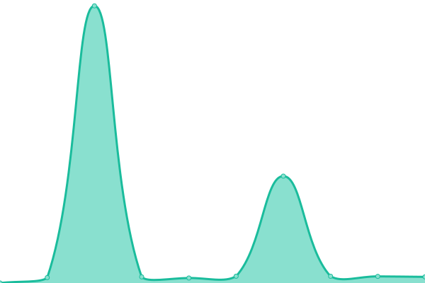 2172ms
     
 | 

<a href="https://status.setditjen-djpb.net/history/tlearning-sekretariat-dj-pb">0.00%</a>
    

|  [DAMS Sekretariat-DJPb](https://dams.setditjen-djpb.net) | 🟩 Up | [dams-sekretariat-dj-pb.yml](https://github.com/FrideyAlpha/uptime-setditjen/commits/HEAD/history/dams-sekretariat-dj-pb.yml) | 

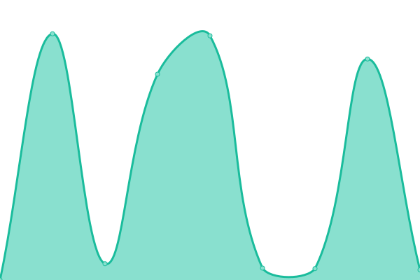 995ms
     
 | 

<a href="https://status.setditjen-djpb.net/history/dams-sekretariat-dj-pb">0.00%</a>
    

|  [Piska Sekretariat-DJPb](http://piska.setditjen-djpb.net) | 🟩 Up | [piska-sekretariat-dj-pb.yml](https://github.com/FrideyAlpha/uptime-setditjen/commits/HEAD/history/piska-sekretariat-dj-pb.yml) | 

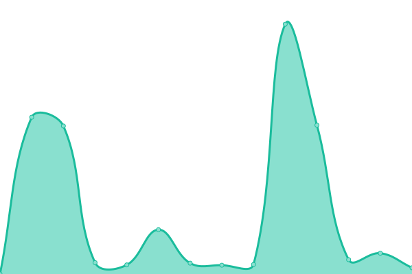 2245ms
     
 | 

<a href="https://status.setditjen-djpb.net/history/piska-sekretariat-dj-pb">91.78%</a>
    

|  [Covid19 Monitoring Sekretariat-DJPb](https://kitc19.setditjen-djpb.net) | 🟩 Up | [covid19-monitoring-sekretariat-dj-pb.yml](https://github.com/FrideyAlpha/uptime-setditjen/commits/HEAD/history/covid19-monitoring-sekretariat-dj-pb.yml) | 

 264ms
     
 | 

<a href="https://status.setditjen-djpb.net/history/covid19-monitoring-sekretariat-dj-pb">100.00%</a>
    

|  [Kanwil Maluku (Tableau)](https://maluku.setditjen-djpb.net) | 🟩 Up | [kanwil-maluku-tableau.yml](https://github.com/FrideyAlpha/uptime-setditjen/commits/HEAD/history/kanwil-maluku-tableau.yml) | 

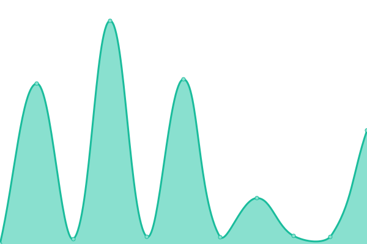 485ms
     
 | 

<a href="https://status.setditjen-djpb.net/history/kanwil-maluku-tableau">100.00%</a>
    

|  [KPPN Lubuk Linggau (Silampari)](https://silampari.setditjen-djpb.net) | 🟩 Up | [kppn-lubuk-linggau-silampari.yml](https://github.com/FrideyAlpha/uptime-setditjen/commits/HEAD/history/kppn-lubuk-linggau-silampari.yml) | 

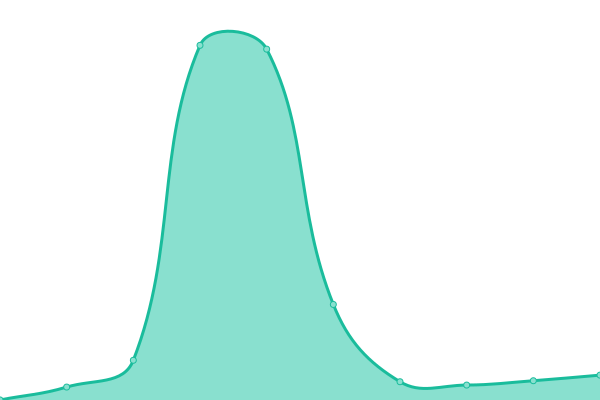 1686ms
     
 | 

<a href="https://status.setditjen-djpb.net/history/kppn-lubuk-linggau-silampari">99.84%</a>
    

|  [Project Management Sekretariat-DJPb](https://project.setditjen-djpb.net) | 🟩 Up | [project-management-sekretariat-dj-pb.yml](https://github.com/FrideyAlpha/uptime-setditjen/commits/HEAD/history/project-management-sekretariat-dj-pb.yml) | 

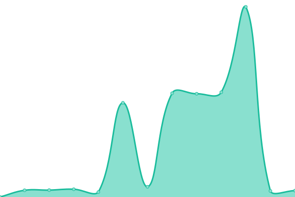 3142ms
     
 | 

<a href="https://status.setditjen-djpb.net/history/project-management-sekretariat-dj-pb">0.00%</a>
    

<!--end: status pages-->

[**Visit our status website →**](https://status.setditjen-djpb.net)

## 📄 License

- Powered by: [Upptime](https://github.com/upptime/upptime)
- Code: [MIT](./LICENSE) © [FrideyAlpha](https://status.setditjen-djpb.net)
- Data in the `./history` directory: [Open Database License](https://opendatacommons.org/licenses/odbl/1-0/)
